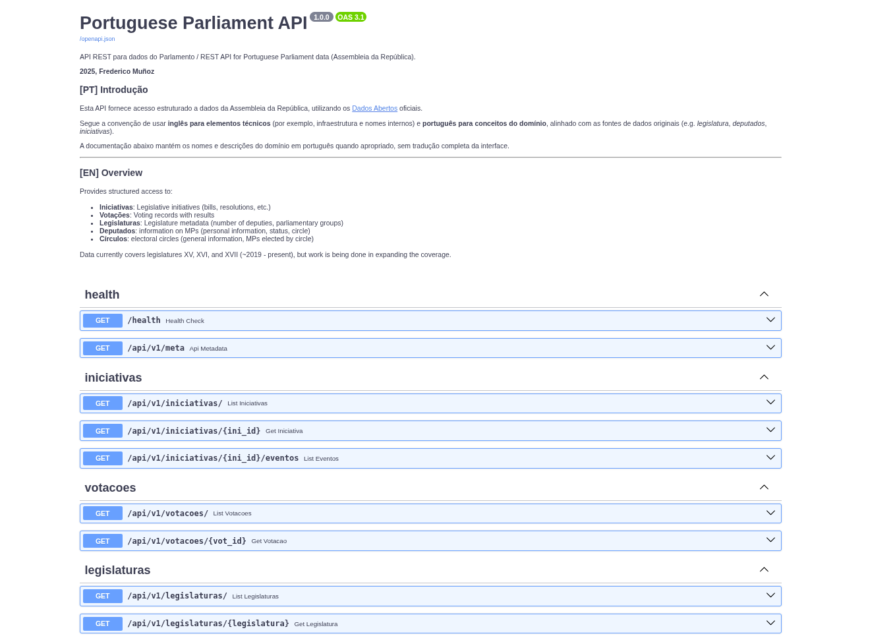
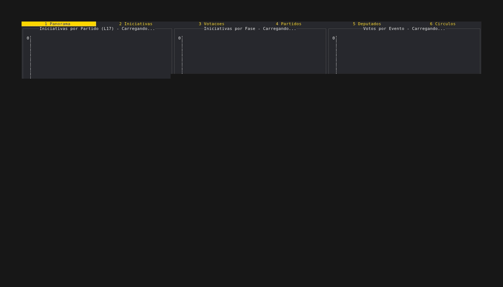
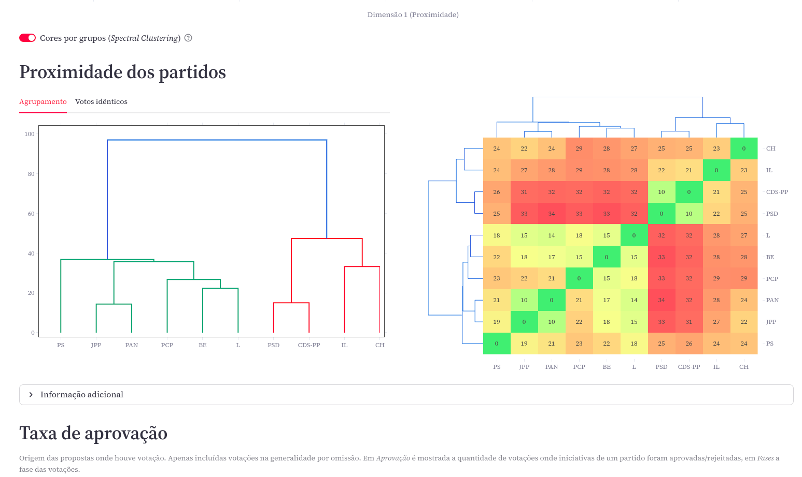
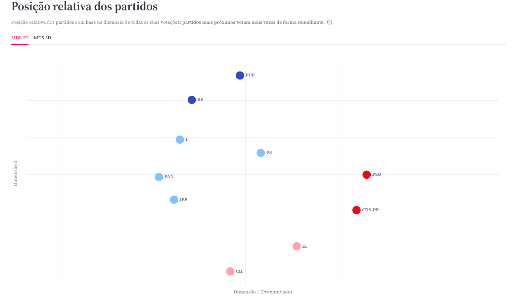
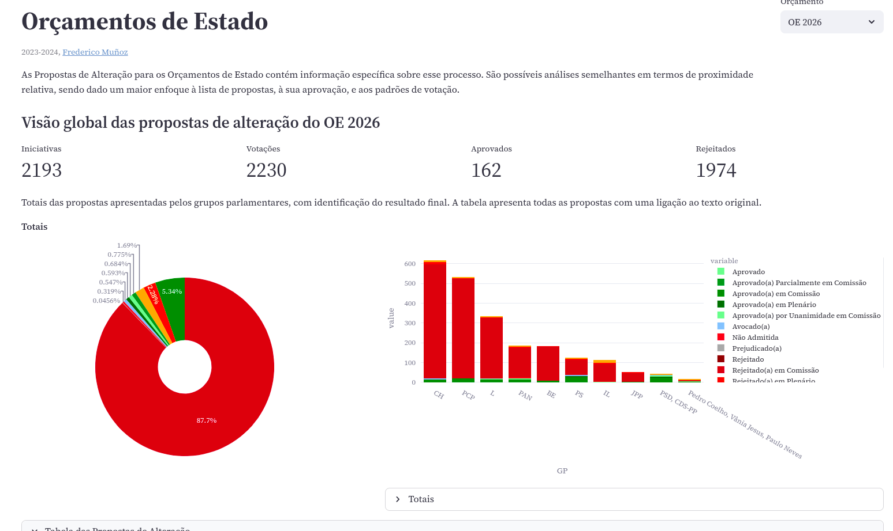
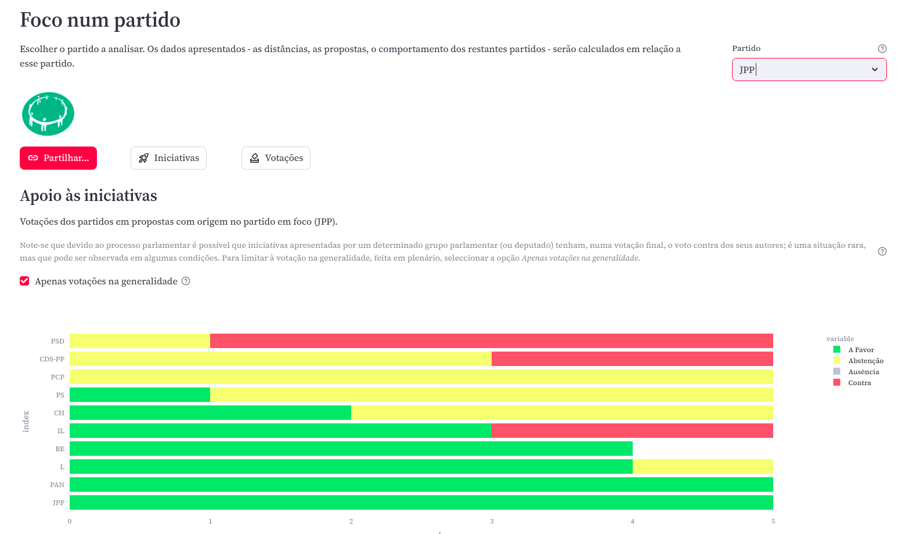

# API Parlamento Português - *Portuguese Parliament Data API*

API REST para acesso estruturado aos dados disponibilizados pelo Parlamento, incluíndo iniciativas,
votações, deputados, partidos, círculos eleitorais.

Disponível em: https://api.votoaberto.org

*REST API providing structured access to Portuguese Parliament data: legislative initiatives, voting
records, deputies, parties, and electoral circles.*

This project is the core component behind http://api.votoaberto.org



## Features

* **21+ REST API Endpoints** - Initiatives, votes, deputies, parties, circles, activities (atividades)... the list will grow.
* **Filtering** - By date, party, type, author, and more (depending on the endpoint). Covers the most common tasks, including searching within titles.
* **Data quality transparency** - Activity votes include `has_party_details` flag showing data completeness
* **Fast queries** (hopefully). DuckDB on Parquet files is quite speedy, with <100ms query times for all tested queries.
* **OpenAPI documentation** - Interactive Swagger UI + ReDoc
* **Data validation** - Pydantic validation on requests/responses
* **Pagination** - Offset-based approach (max 500 per page)
* **Docker ready** - `docker-compose` manifest included.
* **Tests** -  Comprehensive test coverage


Since an API is not something that makes good animations, here is one from the first client that
uses this API, **[ParlaTUI](https://codeberg.org/fsm/parlatui/)** - a TUI explorer for parliamentary
data:




## General approach and technology stack

The project uses **FastAPI** as the building block, and should work with Python 3.12+. The ETL
pipeline is built around the JSON files provided by the official Parliament site, which are then
converted to Parquet. DuckDB is used for querying.

The information made available is an extended subset of the one contained in the source files; more
can be added in the future.

## Quick start

The `requirements.txt` provided can be used with `venv`, and if so the `Makefile` provides some help
in running tests and running the main client-facing app (uvicorn based). Take a look with `make
help` to check what's available

Check `DEPLOYMENT.md` for additional information on deployment choices
and security aspects (Cloudflare, nginx, Cloud Run, etc).

### Environment configuration

Create an `.env` file (see `.env.example`, and copy it to `.env` to get started):

```env
DUCKDB_MEMORY_LIMIT=4GB
DUCKDB_THREADS=4
```

Not everything is being configured in the `.env` file: `config.py` contains the base information
about JSON URLs, etc.

### Local Development

Using Poetry to install dependencies and run the main app:

```bash
# Install dependencies
poetry install

# Run API with auto-reload
poetry run uvicorn app.main:app --reload

# API available at http://localhost:8000
# Docs at http://localhost:8000/docs
```

Alterenatively, use a `venv`:

```bash
# 1. Activate virtual environment
source .venv/bin/activate

# 2. Start the API
make run
```

### Run with Docker

A `docker-compose.yaml` file is included, so this works:

```bash
docker-compose up
# API available at http://localhost:8000
# Interactive docs at http://localhost:8000/docs
```

... or build Docker image manually:

```bash
docker build -t parlamentodb .
docker run -p 8000:8000 parlamentodb
```

### Cloud Run

This project was also tested with Google Cloud Run:

```bash
gcloud run deploy parlamentodb \
  --source . \
  --platform managed \
  --region europe-west1
```

### API approach and example API Calls

In general, any endpoint that returns multiple items will include the content in a `data` element,
and also contain a `pagination` element to allow cursor-based querying. Endpoints that return single
elements will directly return the JSON of what's being requested. This is the desired behaviour and
any inconsistency, if present, will be corrected.

A detailed description of the endpoints here would risk getting stale rather quickly: use the
**interactive documentation** included

* [/docs](/docs) (Swagger UI)
* [/redoc](/redoc) (ReDoc)

The main page redirects to the Swagger UI docs

Some examples (hopefully not out of sync with the current version of the API):

```bash
# List initiatives (returns ini_id for each record)
curl 'http://localhost:8000/api/v1/iniciativas/?limit=5'

# Get a specific initiative by its unique ID
curl 'http://localhost:8000/api/v1/iniciativas/315199'

# Filter by initiative number (may return multiple results)
curl 'http://localhost:8000/api/v1/iniciativas/?ini_nr=7&legislatura=L15'

# Get all events for a specific initiative
curl 'http://localhost:8000/api/v1/iniciativas/315199/eventos'

# Filter events by type and date
curl 'http://localhost:8000/api/v1/iniciativas/315199/eventos?evento_fase=Entrada&data_desde=2025-06-01'

# List atividades (parliamentary activities)
curl 'http://localhost:8000/api/v1/atividades/?legislatura=L17&limit=10'

# Filter atividades by type
curl 'http://localhost:8000/api/v1/atividades/?tipo=VOT&limit=10'

# List votes from atividades
curl 'http://localhost:8000/api/v1/atividades/votacoes/?legislatura=L17&limit=10'

# Filter atividades votes with complete party voting data
curl 'http://localhost:8000/api/v1/atividades/votacoes/?has_party_details=true&limit=10'

# Get statistics including atividades breakdown
curl 'http://localhost:8000/api/v1/stats/?legislatura=L17'
```

## Architecture and components

As mentioned, FastAPI is the core component used, and brings with it several other ones (Swagger, ReDoc, Startlet, Pydantic).

- **FastAPI** - Modern Python web framework with automatic OpenAPI generation
- **Pydantic** - Type validation and serialization
- **DuckDB** - Embedded analytical database (no server needed)
- **Parquet** - Columnar storage format (~26x compression vs JSON)
- **Poetry** - Dependency management

### ETL and data flow

The API uses DuckDB to query the "silver" datasets (Parquet created from the original JSON):

```
       Open Data (JSON)
             |
             v
       ETL Pipeline (fetch + transform)
             |
             v
       Parquet Files (data/silver/*.parquet)
             |
             v
       DuckDB Queries
             |
             v
       FastAPI Endpoints
             |
             v
       JSON Responses
```

The used data tiers are:

1. `bronze`: the original JSON files.
2. `silver`: Parquet files, the result of the transformation process.
3. `gold`: not currently used, but reserved for files with new data (derivatives of the original one)

To run the ETL pipeline:

```bash
# All legislatures (default)
make etl-all

# Latest legislature only (L17) - faster for daily updates
make etl-latest

# Specific legislature
python -m etl -l L16
python -m etl.transform -l L16
```

See the **ETL Pipeline** section below for comprehensive examples and options.

## Testing

Effort has been made to add tests, using pytest. The Makefile has some useful targets:

```bash
# Run all tests
make test

# Run without property tests (faster)
make test-quick

# Run with coverage
poetry run pytest --cov=app tests/
```

## ETL Pipeline

The API serves data processed through an ETL pipeline that:

1. Fetches JSON from Portuguese Parliament Open Data
2. Normalizes field names (PascalCase -> snake_case)
3. Converts to Parquet format
4. Adds metadata (legislature, etl_timestamp)

### Running the ETL

**All legislatures (default)**:
```bash
# Fetch + transform all legislatures (L13-L17)
make etl-all

# Or step by step:
make etl-fetch      # Fetch all
make etl-transform  # Transform all

# Or directly with Python:
python -m etl              # Fetch all
python -m etl.transform    # Transform all
```

**Single legislature (faster)**:
```bash
# Fetch + transform latest legislature only (L17)
make etl-latest

# Or step by step:
make etl-fetch-latest      # Fetch L17 only
make etl-transform-latest  # Transform L17 only

# Or directly with Python:
python -m etl -l L17              # Fetch L17 only
python -m etl.transform -l L17    # Transform L17 only

# Multiple specific legislatures:
python -m etl -l L17,L16          # Fetch L17 and L16
python -m etl.transform -l L17,L16
```

**Parameterized (any legislature)**:
```bash
# Fetch + transform specific legislature via Makefile variable
make etl-fetch-leg LEG=L16
make etl-transform-leg LEG=L16
```

**With flags**:
```bash
# Skip atividades for faster processing
python -m etl -l L17 --skip-atividades
python -m etl.transform -l L17 --skip-atividades

# See all options
python -m etl --help
python -m etl.transform --help
```

Data lands in `data/silver/*.parquet` and the API automatically picks up new data.

### Data Layers

**Bronze Layer** (`data/bronze/`):
- Raw JSON downloads from parlamento.pt
- Complete preservation of source data, as-is.
- Files: `iniciativas_l17.json`, etc.

**Silver Layer** (`data/silver/`):
- Normalized Parquet files
- snake_case field names
- Nested structures preserved as STRUCT/LIST types
- Files: `iniciativas_l17.parquet`, `votacoes_l17.parquet`, etc.
- Compression: ZSTD (~26x size reduction)

### Configuration

Edit `config.py` to add/modify legislatures:

```python
LEGISLATURES = {
    "L17": {
        "url": "https://app.parlamento.pt/webutils/docs/doc.txt?...",
        "name": "XVII Legislatura",
        "start_date": "2025-06-03",
    },
    # Add more legislatures here
}
```

### ETL Performance

**Overall (3 Legislatures):**
- Total records: 4,058 initiatives + 3,792 votes
- Total JSON: 114.80 MB
- Total Parquet: 4.39 MB
- Average compression: **26.18x**
- Processing time: ~5 seconds total

---

## Project Structure

This will likely be different due to ongoing changes, but for now it serves the purpose of showing
what goes where:

```
parlamentodb/
├── app/                      # FastAPI application
│   ├── main.py              # Application entry point
│   ├── config.py            # Settings via pydantic-settings
│   ├── dependencies.py      # Shared dependencies (DuckDB connection)
│   ├── routers/             # API endpoints
│   │   ├── iniciativas.py   # /api/v1/iniciativas
│   │   ├── votacoes.py      # /api/v1/iniciativas/votacoes
│   │   ├── atividades.py    # /api/v1/atividades (NEW)
│   │   ├── deputados.py     # /api/v1/deputados
│   │   ├── circulos.py      # /api/v1/circulos
│   │   ├── partidos.py      # /api/v1/partidos
│   │   ├── stats.py         # /api/v1/stats
│   │   ├── legislaturas.py  # /api/v1/legislaturas
│   │   └── health.py        # /health
│   └── models/              # Pydantic response models
│       ├── iniciativa.py
│       ├── votacao.py
│       ├── atividade.py     # Atividades models (NEW)
│       ├── deputado.py
│       ├── stats.py
│       └── ...
├── etl/                     # ETL pipeline
│   ├── fetch.py            # Download JSON from parlamento.pt
│   ├── transform.py        # JSON -> Parquet transformation
│   └── schema.py           # Field name mappings
├── data/
│   ├── bronze/             # Raw JSON files
│   └── silver/             # Normalized Parquet files
├── tests/                  # Test suite
├── docker-compose.yml      # Local deployment
├── Dockerfile              # Production deployment
├── pyproject.toml          # Poetry dependencies
└── README.md
```

## Data Source

**Portuguese Parliament Open Data**
https://www.parlamento.pt/Cidadania/Paginas/DadosAbertos.aspx

All data is publicly available under the Assembleia da República open data initiative. This API provides structured access to:

- Legislative initiatives (Iniciativas)
- Voting sessions from initiatives (Votações)
- Parliamentary activities (Atividades) - condemnation votes, motions, elections, etc.
- Voting sessions from activities (Atividades Votações)
- Deputy information (Deputados)
- Parliamentary groups (Partidos)
- Electoral circles (Círculos)

**Note on Atividades Data Quality**: Only 8-20% of atividades votes include complete party voting details: this is not a bug, and it's not even an error, it's due to the fact that many of the these votes are approved unanimously, and the source data register the approval, the fact that it was unanimous, and does not fill in the "detalhe" field for those votes since it's assumed that everyone voted in favour. The API includes a `has_party_details` flag to filter for complete data or handle incomplete records appropriately, just in case it's needed.

The information used is from the "Iniciativas", "Atividades", and "Informação Base" data sources.
---

## Related Projects

**[Portal](https://www.votoaberto.org)** - Advanced visualizations and analytics.

Online portal that consumes this API to provide:

- Party distance and clustering analysis

- MDS analysis

- Deputy voting patterns
- Interactive visualizations

- User quizzes
- Details about party iniciatives and votes

- MP voting records
- Geographical origin of MPs

... and more

**[ParlaTUI](https://codeberg.org/fsm/parlatui/)** - a TUI explorer for parliamentary data.

TUI application that uses this API to provide an overview of parliamentary activty, covering some of the same ground as the portal. 


---

## License


GNU Affero General Public License v3.0.

